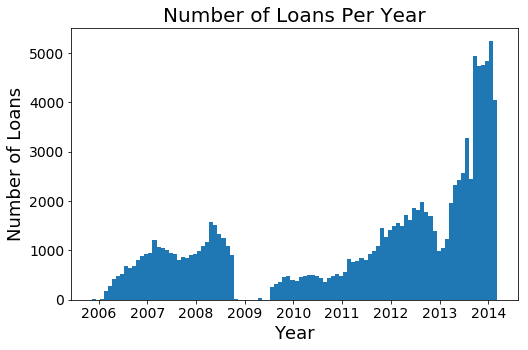
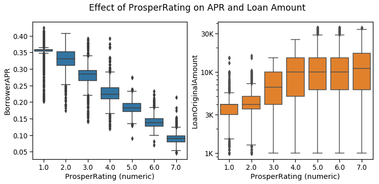
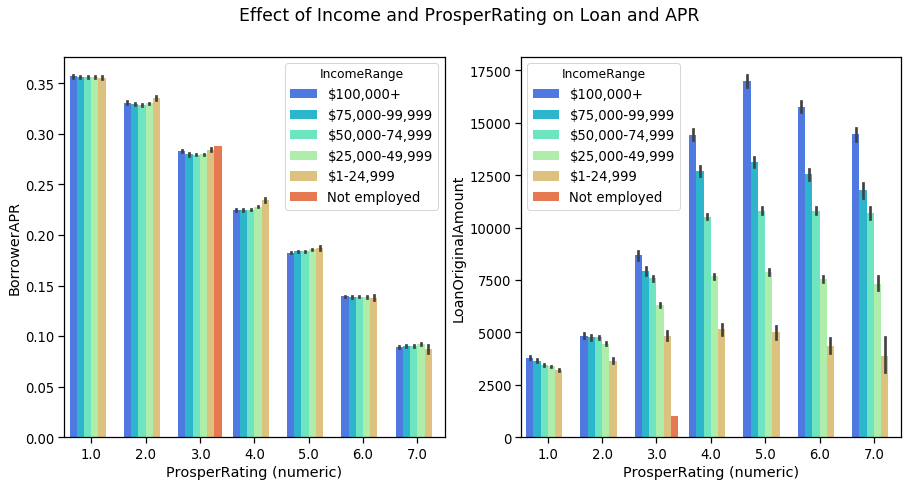

# Parameters effecting APR and Loan Amount in the Prosper Loan Dataset
## by Arjun Adhikari

## Prosper Loan Dataset

> In this project, I will be investigating the Prosper Loan Dataset. This dataset contains records of Loans made by Prosper during the time frame of 2008-2014. The dataset contains 100,000+ entries, and has 81 different categories. My main interest is to understand what factors affect the loan amount and Interest Rates. For this purpose, I picked out a few numerical (continuous and discrete) and categorial parameters. 

>One of the primary variables of interest is the ProsperRating, which has only 84,800 entries. Once I created a new dataframe with these variables, I dropped the NaN values, and the final dataset contained 76,000+ entries.  To examine dataset, first I performed univariate exploration to understand the distribution of the dataset. Next, I looked at bivariate exploration to understand how different numerical and categorical variables affect the APR and LoanAmount. Here a heat map  was particularly useful to examine correlation coeffient between various different numerical variables, and this guided furthur data exploration. Lastly, I used multivariate exploration to examine how different variables, such as year, EmploymentStatus, IncomeRange and LoanTerm affected APR and LoanAmounts for different ProspectScores. Lastly, how looked at how these variables affected the rating of APR vs LoanAmounts. 

## Summary of Findings

> Univariate Exploration
1. Looking at the number of loans over time, there were very few loans around 2009, during the economic crisis. However, since 2010, there was a significant rise in number of loans. 
2. Borrower APR is normally distributed
3. Monthly earnings need to be transformed to a log scale to see a normal distribution 
4. CreditRatings are in multiples of 20, between 600-900
5. Most of the loans are for Debt Consolidation 
6. $50-75k is the income range with the most counts, and this is also the mean American Income
7. A majority of the loans are current, and there are very few past due loans. 
8. The ProsperScore is normally distributed. So is the APR, and this suggests that there could be a strong correlation between the APR and ProsperScore. 
9. Most of the people with the Loans are employed, therefore one can conclude that being employed definitely boosts you chances of securing a loan

> Bivariate Exploration 
1. A correlation heatmap gives us the correlation coefficients between the numerical variables 
    1. Borrower APR is negatively correlated to the Prosper Rating and Credit Score
    2. The loan amount is positively correlated to the Prosper Rating and Monthly Income
2. A combination of regplot, scatterplot and boxplots show that APR is negatively correlated to the Prosper Rating and Credit Score
3. StatedMonthlyIncome and ProsperRating are correlated positively to LoanAmount
4. Box plots are used to show that APR is affected by IncomeRange
5. Box plots show that the LoanAmount is affected by ProsperScore, EmploymentStatus, LoanStatus and IncomeRange

>Multivariate Exploration
How categorical variables effect BorrowerAPR for different prosperRatings
1. Employment Status - We see that all the points denoting different employment types are clustered together. This shows that PropserRating has more impact than EmploymentType
2. LoanStatus - For Lower values of ProsperRating (4 or less), the current LoanStatus has a APR values, but at higher ProsperRatings, they are pretty closely clustered. We can conclude the LoanStatus can have a significant impact if the borrower has a lower ProsperRating 
3. Year - The APR for different ProsperRatings do not change over the years. 
4. Term - For higher ProsperRatings, a long term loan leads to a lower APR. 
> How categorical variables effect LoanAmount for different prosperRatings
1. Employment Status - There is a huge variation in the values, as seen by the large error bars, but one thing is clear that the employed borrowers are able the get the highest loans 
2. LoanStatus - Borrowers who are current with their loan payments have been able to get higher loan amounts than those who have defaulted or are past due. 
3. Year - The loan amount has been higher in the recent years, especially for ProsperRating 3.0 or higher
4. Term - Larget loan amounts are for longer terms. 
> Effect of IncomeRange on LoanOriginalAmount and BorrowerAPR vs ProsperRating
1. LoanOriginalAmount: There is no real affect of IncomeRange on Loan amount for lower ProsperScores, but for scores higher than 4, higher loans are given to borrowers with larger Incomes 
2. The income range does not alter the APR for a given ProsperScore. 
> APR vs LoanAmount (two continuous numeric variables) multivariate analysis
1. Loans made after 2012 are mostly greater than $2000 and all loans made before that are usually of lower value. 
2. A large fraction loans higher than 20K are made after 2010.
3. There is a clear gradient of the ProsperRatings vs APR, and we see that the lowest APRs are associated with the highest ratings. 
4. The loans > $22000 are almost all have higher than 6.0 ProsperRating and a low APR.
5. Monthly payments are most directly correlated to loanAmount

## Key Insights for Presentation

> Univariate Explanatory: Here we will look at the number of loans vs time, as the insight of nearly no loans during 2009 and the increasing numbers after that provides a key insight into the economy. 

> Bivariate: Here we will look at how the APR and LoanAmount are affected by ProsperScore, EmploymentStatus, LoanStatus and IncomeRange

>Multivariate: How categorical variables effect APR and LoanAmount for different prosperRatings

